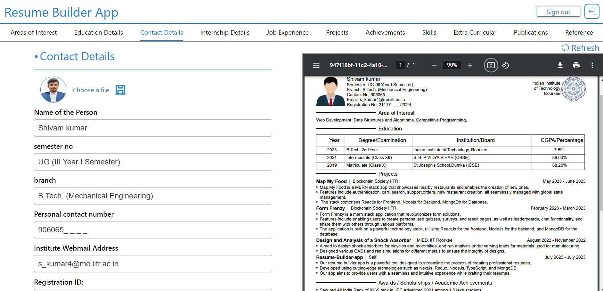

[![Contributors][contributors-shield]][contributors-url]
[![Forks][forks-shield]][forks-url]
[![Stargazers][stars-shield]][stars-url]
[![Issues][issues-shield]][issues-url]
[![MIT License][license-shield]][license-url]
[![LinkedIn][linkedin-shield]][linkedin-url]

<br />
<div align="center">
<a href="https://github.com/shivam6862/Resume-Builder-app">
   
</a>
<h2 align="center">Resume Builder App</h2>

  <p align="center">
   Craft Your Perfect Resume with Our Advanced Builder App
    <br />
    <br />
    <a href="https://github.com/shivam6862/Resume-Builder-app/issues">Report Bug</a>
    ·
    <a href="https://github.com/shivam6862/Resume-Builder-app/issues">Request Feature</a>
  </p>
</div>

<details>
  <summary>Table of Contents</summary>
  <ol>
    <li>
      <a href="#about-the-project">About The Project</a>
      <ul>
        <li><a href="#built-with">Built With</a></li>
      </ul>
    </li>
    <li><a href="#usage">Description</a></li>
    <li><a href="#usage">Snapshot Gallery</a></li>
    <li><a href="#contributing">Contributing</a></li>
    <li><a href="#acknowledgments">Acknowledgments</a></li>
  </ol>
</details>

## About The Project

Our resume builder app is a powerful tool designed to streamline the process of creating professional resumes. Developed using cutting-edge technologies such as Next.js, Redux, Node.js, TypeScript, and MongoDB, our app aims to provide users with a seamless and intuitive experience while crafting their resumes.

<p align="right">(<a href="#readme-top">back to top</a>)</p>

### Built With

- [![react][react]][react-url]
- [![next][next]][next-url]
- [![reduxjs][reduxjs]][reduxjs-url]
- [![typescript][typescript]][reduxjs-url]
- [![NodeJs][NodeJs]][NodeJs-url]
- [![mongodb][mongodb]][mongodb-url]
- [![VisualStudioCode][VisualStudioCode]][VisualStudioCode-url]

<p align="right">(<a href="#readme-top">back to top</a>)</p>

## Getting Started

So as to run our project locally, you need to follow the steps below.

### Installation

1. Clone the repo
   ```sh
   git clone https://github.com/shivam6862/Resume-Builder-app.git
   ```
2. Install NPM packages on Frontend folders
   ```sh
   npm install
   ```
3. Enter your BACKEND URL in `.env` of Frontend directory
   ```sh
   VITE_REACT_BACKEND_URL=http://localhost:8080
   ```
4. Run the project in Frontend using
   ```sh
   npm run dev
   ```
5. You can now view the project at `http://localhost:3000/`

6. Install NPM packages on Backend folders
   ```sh
   npm install
   ```
7. Enter your MONGODB DATABASE URL and put it in `.env` file in backend directory
   ```sh
   MONGODB_URL= "your mongodb url"
   ```
8. Make the database in your mongodb server named as `Resume-Builder-app`
   ```sh
   resumes
   users
   ```
9. Run the project in backend using
   ```sh
   npm start
   ```

<p align="right">(<a href="#readme-top">back to top</a>)</p>

<!-- USAGE EXAMPLES -->

## Description

In today's competitive job market, a well-crafted resume can make all the difference in securing that dream job. However, creating a visually appealing and comprehensive resume can be a time-consuming and challenging task. That's where our resume builder app comes in.</br>

The resume builder app is designed to help individuals create impressive resumes that stand out in today's competitive job market. By leveraging the power of Next.js, Redux, Node.js, TypeScript, and MongoDB, we have developed a feature-rich application that streamlines the resume creation process.</br>

###### Key Features

- User-Friendly Interface: The app offers an intuitive interface, ensuring that users can easily navigate through the resume-building process.
- Dynamic Sections: Include relevant sections such as education, work experience, skills, projects, certifications, and more. Customize the sections based on your specific needs.
- Real-Time Preview: Visualize your resume as you build it, allowing you to make instant adjustments and ensure a polished and professional result.
- Export Options: Export your resume as a PDF or share it directly with potential employers or job platforms to maximize your job search opportunities.
- Data Persistence: Your progress is securely stored using MongoDB, ensuring that you can access and modify your resume whenever and wherever needed.

## Snapshot Gallery

<h2>Resume Edit Page</h2>
<a href="https://github.com/shivam6862/Resume-Builder-app"></a>

<p align="right">(<a href="#readme-top">back to top</a>)</p>

<!-- CONTRIBUTING -->

## Contributing

Contributions are what make the open source community such an amazing place to learn, inspire, and create. Any contributions you make are greatly appreciated.

If you have a suggestion that would make this better, please fork the repo and create a pull request. You can also simply open an issue with the tag "enhancement".
Don't forget to give the project a star! Thanks again!

1. Fork the Project
2. Create your Feature Branch (`git checkout -b feature/AmazingFeature`)
3. Commit your Changes (`git commit -m 'Add some AmazingFeature'`)
4. Push to the Branch (`git push origin feature/AmazingFeature`)
5. Open a Pull Request

<p align="right">(<a href="#readme-top">back to top</a>)</p>

<!-- CONTACT -->

## Acknowledgments

Use this space to list resources you find helpful and would like to give credit to. I've included a few of my favorites to kick things off!

- [GitHub Pages](https://pages.github.com)
- [Font Awesome](https://fontawesome.com)

<p align="right">(<a href="#readme-top">back to top</a>)</p>

[contributors-shield]: https://img.shields.io/github/contributors/shivam6862/Resume-Builder-app.svg?style=for-the-badge
[contributors-url]: https://github.com/shivam6862/Resume-Builder-app/graphs/contributors
[forks-shield]: https://img.shields.io/github/forks/shivam6862/Resume-Builder-app.svg?style=for-the-badge
[forks-url]: https://github.com/shivam6862/Resume-Builder-app/network/members
[stars-shield]: https://img.shields.io/github/stars/shivam6862/Resume-Builder-app.svg?style=for-the-badge
[stars-url]: https://github.com/shivam6862/Resume-Builder-app/stargazers
[issues-shield]: https://img.shields.io/github/issues/shivam6862/Resume-Builder-app.svg?style=for-the-badge
[issues-url]: https://github.com/shivam6862/Resume-Builder-app/issues
[license-shield]: https://img.shields.io/github/license/shivam6862/Resume-Builder-app.svg?style=for-the-badge
[license-url]: https://github.com/shivam6862/Resume-Builder-app/blob/master/LICENSE.txt
[linkedin-shield]: https://img.shields.io/badge/-LinkedIn-black.svg?style=for-the-badge&logo=linkedin&colorB=555
[linkedin-url]: https://linkedin.com/in/shivam-kumar-14701b249/
[react]: https://img.shields.io/badge/React-20232A?style=for-the-badge&logo=react&logoColor=61DAFB
[react-url]: https://react.dev/
[VisualStudioCode]: https://img.shields.io/badge/Made%20for-VSCode-1f425f.svg
[VisualStudioCode-url]: https://code.visualstudio.com/
[nodejs-url]: https://nodejs.org/en
[nodejs]: https://img.shields.io/badge/Node.js-43853D?style=for-the-badge&logo=node.js&logoColor=white
[mongodb-url]: https://www.mongodb.com/
[mongodb]: https://img.shields.io/badge/MongoDB-4EA94B?style=for-the-badge&logo=mongodb&logoColor=white
[next-url]: https://nextjs.org/docs
[next]: https://img.shields.io/badge/next.js-000000?style=for-the-badge&logo=nextdotjs&logoColor=white
[reduxjs-url]: https://redux.js.org/
[reduxjs]: https://img.shields.io/badge/Redux-593D88?style=for-the-badge&logo=redux&logoColor=white
[typescript-url]: https://www.typescriptlang.org/docs/handbook/typescript-in-5-minutes.html
[typescript]: https://img.shields.io/badge/TypeScript-007ACC?style=for-the-badge&logo=typescript&logoColor=white
